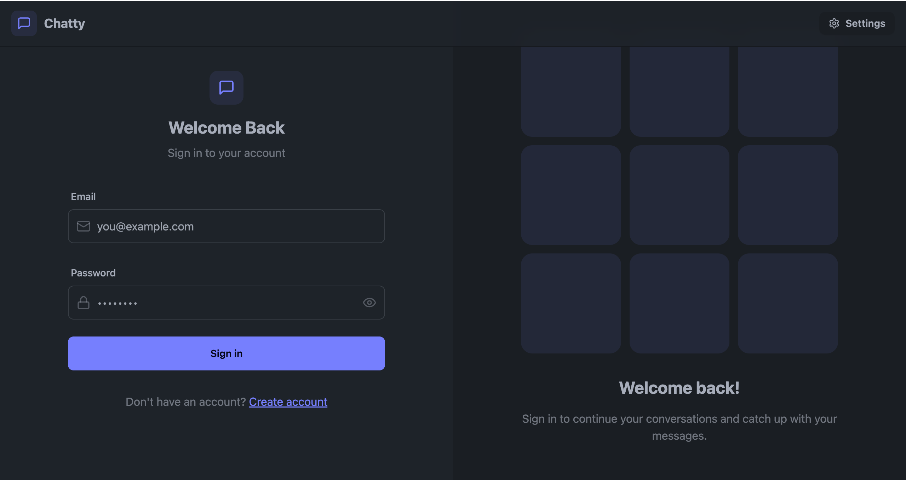
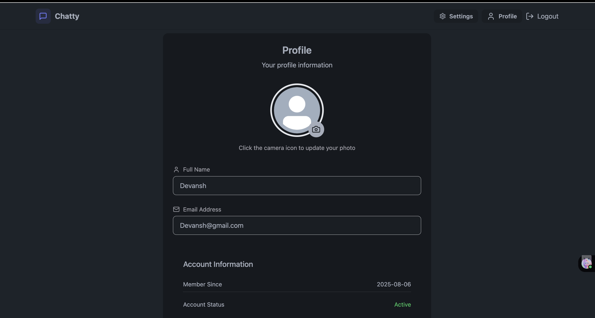
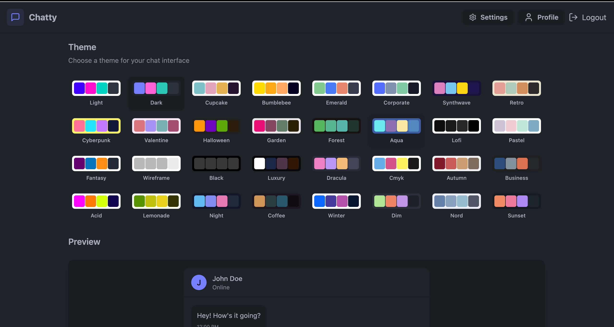

# 💬 Chatty - Real-Time MERN Chat Application

**Chatty** is a modern, full-stack real-time chat application built using the **MERN** stack (MongoDB, Express.js, React.js, Node.js) with **Socket.IO** for instant messaging. It supports private chats, group messaging, media sharing (images), typing indicators, and theme customization.

🚀 Try it live: [https://chatty-onlinechattingapp.onrender.com]

---

## 📸 Screenshots






---

## ✨ Features

- ⚡ Real-time messaging with **Socket.IO**
- 🔐 Secure authentication with **JWT** & **bcrypt**
- 🧑‍🤝‍🧑 Support for **one-on-one & group chats**
- 📤 Send and receive **images**
- 🧑‍🎨 **User profiles** with avatars
- ⌨️ Typing indicators for live typing feedback
- 🔍 Search users and groups easily
- 🌓 Theme switching with **Daisy UI**
- 📱 Fully **responsive** design (mobile + desktop)
- 🔔 In-app **notifications**
- ☁️ Image storage with **Cloudinary**
- ⚙️ Global state managed with **Zustand**

---

## 🧑‍💻 Tech Stack

| Layer        | Tech Stack                         |
|--------------|------------------------------------|
| Frontend     | React.js, Tailwind CSS, Daisy UI, Axios |
| Backend      | Node.js, Express.js                |
| Database     | MongoDB, Mongoose                  |
| Real-time    | Socket.IO                          |
| Authentication | JWT, bcrypt                     |
| File Uploads | Cloudinary                         |
| State Management | Zustand                       |

---

## 🛠️ Getting Started

### ⚙️ Prerequisites

Make sure you have the following installed:
- Node.js (v14+)
- npm or yarn
- MongoDB (local or Atlas)

---

### 🔧 Installation

```bash
# Clone the repository
git clone <repository-url>

# Navigate into the project
cd chatty-app

# Install dependencies
npm install
```

---

### 📁 Environment Variables

Create a `.env` file in the root directory and add the following:

```env
MONGODB_URI=your_mongodb_connection_string
PORT=5001
JWT_SECRET=your_jwt_secret_key

CLOUDINARY_CLOUD_NAME=your_cloudinary_cloud_name
CLOUDINARY_API_KEY=your_cloudinary_api_key
CLOUDINARY_API_SECRET=your_cloudinary_api_secret

NODE_ENV=development
```

---

### 🚀 Run the App

```bash
# Build the frontend
npm run build

# Start the server
npm start
```

Open your browser and go to: `http://localhost:5001`

---

## 🤝 Contributing

Want to contribute? Here’s how you can help:

1. Fork the repository
2. Create your feature branch: `git checkout -b feature/YourFeature`
3. Commit your changes: `git commit -m 'Add your feature'`
4. Push to the branch: `git push origin feature/YourFeature`
5. Open a pull request

---

## 📄 License

This project is open source.

---

## 🙌 Acknowledgements

- [React](https://reactjs.org/)
- [Tailwind CSS](https://tailwindcss.com/)
- [Socket.IO](https://socket.io/)
- [MongoDB Atlas](https://www.mongodb.com/cloud/atlas)
- [Cloudinary](https://cloudinary.com/)
- [Daisy UI](https://daisyui.com/)
- [Zustand](https://github.com/pmndrs/zustand)

---

## 👨‍💻 Made with ❤️ by [Devansh Singh](https://www.linkedin.com/in/devanshsingh2006)

---
